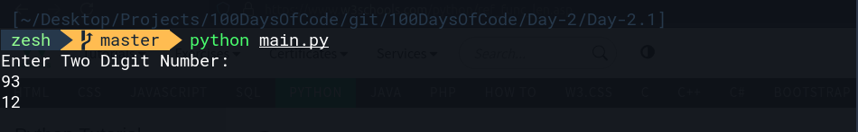

# Day-2.1 Data Types
## Instructions
write the program that adds the digits in a 2 digit number, e.g. if the input was 35, then the output should be 3 + 5 = 8

# Example input
```bash
39
```
# Example output
3 + 9 = 12
```bash
12
```

This code works fine just like the above given instruction, and here is the above code output:
# Example



# Here is code Explanation

```python
# logic for Two Digit Number addition
def two_digit_number_add(num):
# checking for the input number digit length, if it's one digit number it will output "number should have 2 digit"
    if len(num) < 2:
        print("number should have 2 digit")
# checking again for the input number digit length, if it's more than 2 digit it will output "number should have 2 digit" 
    elif len(num) > 2:
        print("number should have 2 digit")
    else:
    # adding the number together, here we are adding the number that is found at index1 and number found at index 2 
        result = int(num[0]) + int(num[1])
        # Printing the resutl
	return result

# main function
def main():
    print("Enter Two Digit Number: ")
    num = input()
    result = two_digit_number_add(num)
    # checking if the input number digit is 2 and they added up to output, else it do nothing
    if result:
        print(result)
    
if __name__ == "__main__":
    main()
```
