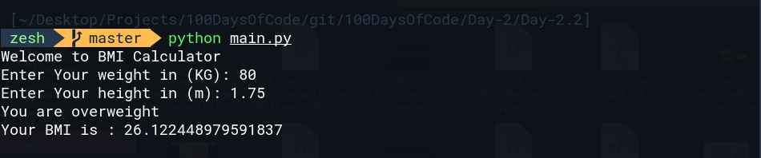

# Day 2.2 BMI Calculator
This program calculate Body Mass Index (BMI) from the user weight and height.

The BMI is a measure of someones weight taking into account there height. e.g. if a tall person and a short person both weight the same amount, short person is usually more overweight

The BMI is calculated by dividing  a person weight (in kg) by the square of theire height (in m)

# Example 



in the above Example we gave 80 as weight input in kg and 1.75 as height in meter and here is how it's calculated

```bash
80 / (1.75 * 1.75) = 26.122448979591837
```
and this man is 
```bash
overweight
````
# Hint
 - Underweight = BMI < 18.5
 - Normal Weight  = BMI 18.5 - 25
 - Overweight = BMI 26 - 30
 - Obse = BMI > 30
