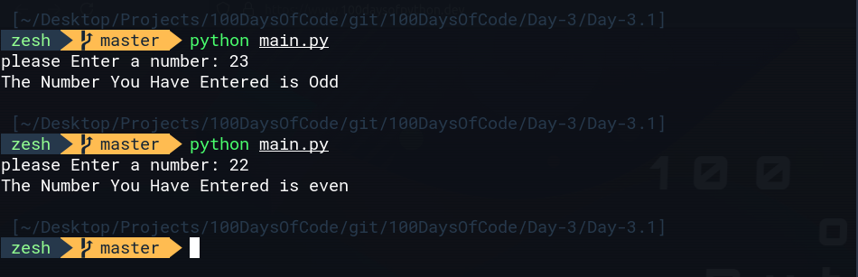

# Day-3.1 Odd or Even
write the program that works out whether if a given number is an odd or even number

# Example
```bash
23 is an odd number since it doesnt be divided to 2 and have the remainder,
if we divided 23 / 2 = 12.5 or 12 with the remainder of 1
```

# Example
```
22 is an even Number sice it can be divided to 2 without the remainder
if we divided 22 /2 = 12. and there we will no or 0 remainder
```

# Program Output



# Hint
- we used % or Modules opperator to differentiate between Odd and Even and in python %symbol is for Modules
