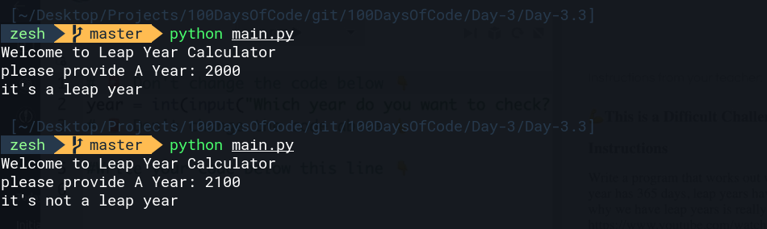

# Day-3.3 Leap Year
## Instruction
write the program that works out whether if a given year is a leap year. a normal year have 365 days and leap year have 366 days, with an extra day on Feburary.

### This is How the logic behind the leap year works:
- on Every year that is evenly divisible by 4
- except every year that is evenly divisible by 100
- unless the year is also evenly divisible by 400

e.g. The year 2000
```bash
2000 / 4 = 500 (leap)
2000 / 100 = 20 (not leap)
2000 / 400 = 5 (leap)

##### Therefore 2000 is a leap year
```
But the year 2100 is not a leap year because:
```bash
2100 / 4 = 525 (leap)
2100 / 100 = 21 (not leap)
2100 / 400 = 52.5 (not leap)

##### Therefore 2100 is not a leap year
```

# Example of the output code


