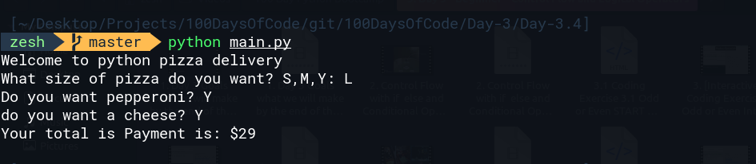

# Day- 34 - Pizza Order
Build an automation pizza order program:
based on the user's order, workout there final bill
```bash
small pizza : $15,
medium pizza : $20,
large pizza : $25

pepperoni for small pizza = $2
pepperoni for medium and large pizza: $3
Cheese : $1
```
# Example Input:
```bash
size = "L"
pepperoni = "Y"
cheese = "Y"
```
# Example output
```bash
Your total payment is : $29
```
# Example output of the code:

