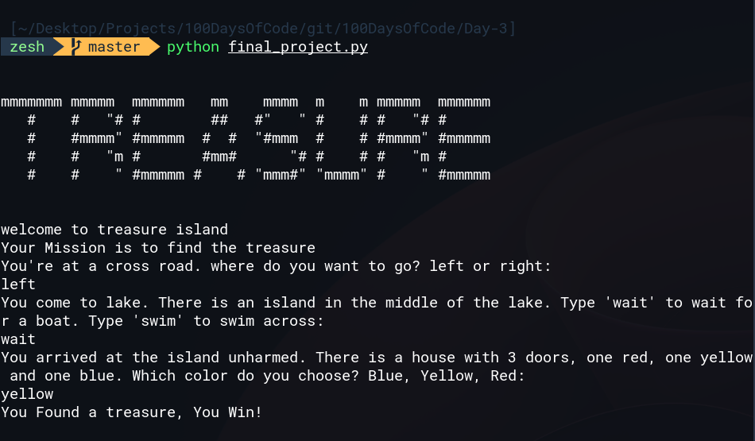

# Final Project
# Treasure Island Game
In this game user try to find the treasure from the island, while the game asking the user couple of the question and wait the answer from the user, if user gave the correct answer the game continue asking the question until the user found the Treasure

Here is the program example
# Example Output of the Code

