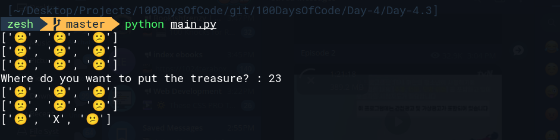

# Day 4.3 Treasure Map
This program allow user to position the Treasure using a two-digit system, the first digit is the horizontal column and the second digit represent the vertical row.

Example input:
column 2 row 3
```bash
23
```
Example output
```bash
[😕] [😕] [😕]
[😕] [😕] [😕]
[😕] [X]  [😕]
```

Here is the code output

