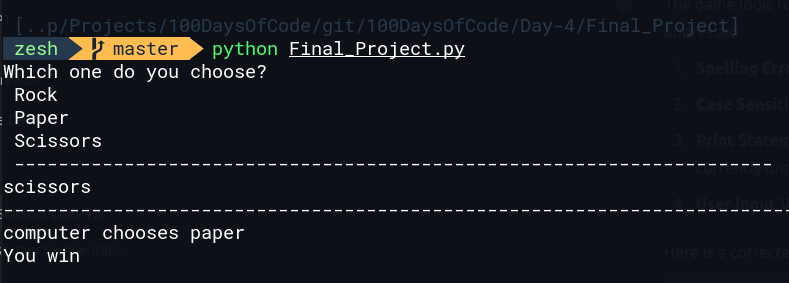

# Final Project -> Rock Paper and Scissors Game
This is a simple game using python as a final project from 100 days of coding, this is the final project for day of 4. 

## Game Strategy
```bash
- Rock is greater than Scissor
- Paper is greater than Rock
- Scissor is greater than Paper
```
## Example 
```bash
if the user choose Rock and computer chooses Scissor, then user is the winner. see the above table for more understanding
```

## Example output 

